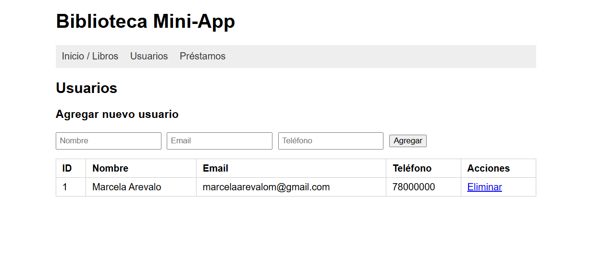
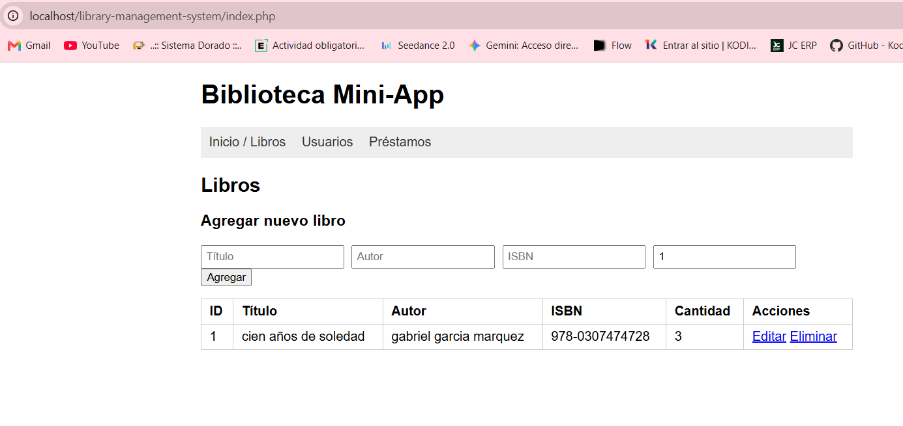
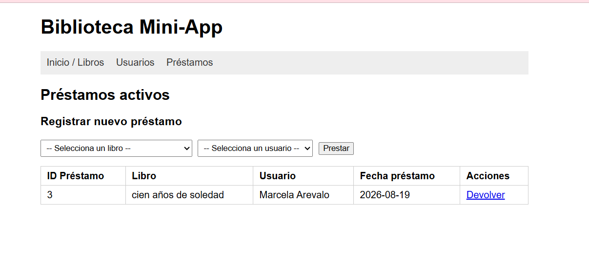

# Tarea: Sistema de Gestión de Biblioteca (Mini-Aplicación OOP)

## Objetivo
Completar la implementación de un sistema de gestión de biblioteca utilizando PHP y Programación Orientada a Objetos (OOP). Se te proporciona la estructura base de archivos y clases. Tu misión es rellenar la lógica faltante.

## Configuración Inicial

1.  **Base de Datos**:
    *   Abre tu gestor de base de datos (phpMyAdmin, MySQL Workbench, etc.).
    *   Importa o ejecuta el script SQL contenido en el archivo `biblioteca.sql`.
    *   Esto creará la base de datos `biblioteca` y las tablas necesarias (`libros`, `usuarios`, `prestamos`).

2.  **Servidor Local**:
    *   Asegúrate de ejecutar este proyecto dentro de un servidor local (como XAMPP, Laragon, o el servidor integrado de PHP).

## Instrucciones de Implementación

Busca los comentarios `// TODO` en los archivos para saber exactamente qué implementar. Se recomienda seguir este orden:

### Paso 1: Conexión a Base de Datos
**Archivo:** `classes/Database.php`
*   Implementa el método `getConnection()` para retornar una conexión PDO válida a la base de datos `biblioteca`.
*   Asegúrate de que las credenciales (usuario/password) coincidan con tu configuración local.

### Paso 2: Clases de Modelo
**Archivos:** `classes/Libro.php`, `classes/Usuario.php`, `classes/Prestamo.php`
*   Completa los **constructores** para inicializar los atributos de la clase.
*   Implementa todos los métodos **Getters** y **Setters** para cada propiedad privada.

### Paso 3: Lógica de Negocio (Gestor)
**Archivo:** `classes/Biblioteca.php`
Esta clase centraliza la funcionalidad. Debes implementar:
*   **Constructor**: Inicializar la conexión a la base de datos usando la clase `Database`.
*   **CRUD de Libros**: Métodos `agregarLibro`, `editarLibro`, `eliminarLibro`, `obtenerLibros`.
*   **CRUD de Usuarios**: Métodos `agregarUsuario`, `editarUsuario`, `eliminarUsuario`, `obtenerUsuarios`.
*   **Gestión de Préstamos**:
    *   `prestarLibro($libro_id, $usuario_id)`: Debe crear el registro en la tabla `prestamos` Y disminuir el campo `cantidad` en la tabla `libros`.
    *   `devolverLibro($prestamo_id)`: Debe actualizar la `fecha_devolucion` y `estado` en `prestamos`, Y aumentar el campo `cantidad` en la tabla `libros`.

### Paso 4: Interfaz de Usuario
**Archivo:** `index.php`
*   Implementa la lógica para recibir parámetros (por ejemplo `?action=crear_libro`) y llamar a los métodos correspondientes de la clase `Biblioteca`.
*   Diseña la interfaz HTML para:
    *   Listar libros, usuarios y préstamos activos.
    *   Formularios para agregar nuevos libros y usuarios.
    *   Botones/Enlaces para "Prestar", "Devolver", "Editar" y "Eliminar".

## Requisitos
*   El código debe ser limpio y ordenado.
*   La lógica de negocio debe estar encapsulada en las clases, no en la vista (`index.php` debe usarse principalmente para mostrar datos y capturar input).
*   No es necesario un sistema de login/autenticación.

¡Mucho éxito con tu implementación!

## Funcionalidades Implementadas

- **Conexión a base de datos**: `classes/Database.php` implementa la conexión PDO a MySQL con manejo de errores (try/catch).
- **Clases de modelo**: `Libro.php`, `Usuario.php` y `Prestamo.php`, con constructores y getters/setters completos.
- **CRUD de Libros**: agregar, editar, eliminar y listar libros.
- **CRUD de Usuarios**: agregar, editar, eliminar y listar usuarios.
- **Gestión de Préstamos**: `prestarLibro()` crea el registro y descuenta la cantidad disponible; `devolverLibro()` marca el préstamo como devuelto y repone la cantidad.
- **Interfaz (`index.php`)**: enrutamiento por parámetro `?action=`, formularios de alta, listados dinámicos, y acciones de préstamo/devolución/edición/eliminación.

## Capturas de Pantalla

### Gestión de Libros

### Gestión de Usuarios

### Gestión de Préstamos
